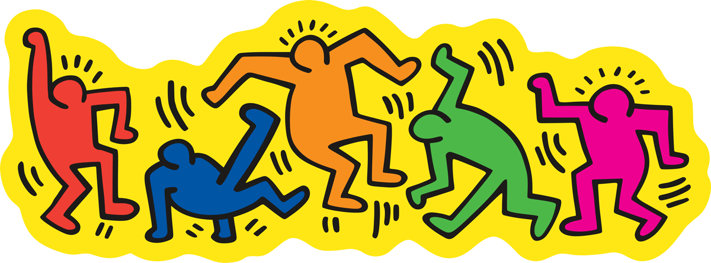

# Quiz 8 Imaging & Coding Inspiration
**Name:** Yujian Li  
**Artist Chosen:** Keith Haring

## Part 1 Imaging Technique Inspiration
Keith Haring’s art inspires me because of his bold lines, bright colors, and simple human shapes. His works feel movement and life. I like how he turns everyday actions and emotions into powerful visual symbols. For my project, I want to use a similar line style and limited color to show human energy and connection. I think this technique is great because it’s fun, expressive, and easy for people to understand.

  

## Part 2 Coding Technique Exploration (p5.js)
The p5.js sketch in video shows how to draw smooth and animated lines using `beginShape()` and `vertex()`.The movement of the lines looks very organic, almost like they are alive. This reminds me of Keith Haring’s wavy outlines and his energetic drawing style. I want to use this technique to make my lines move and flow, showing human energy and rhythm. The idea of using noise to create natural motion fits well with Haring’s playful and continuous line work.

**Example Video:**  
[Animated Drawing Example (YouTube)](https://www.youtube.com/watch?v=m_1lBVxIdM4)
